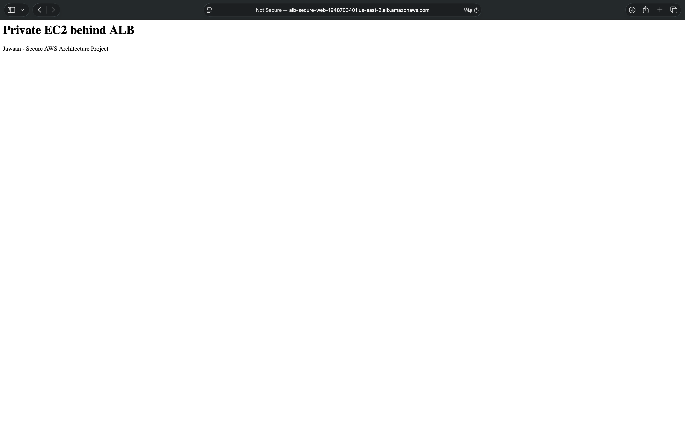
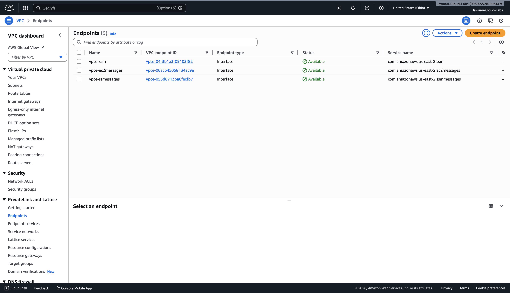
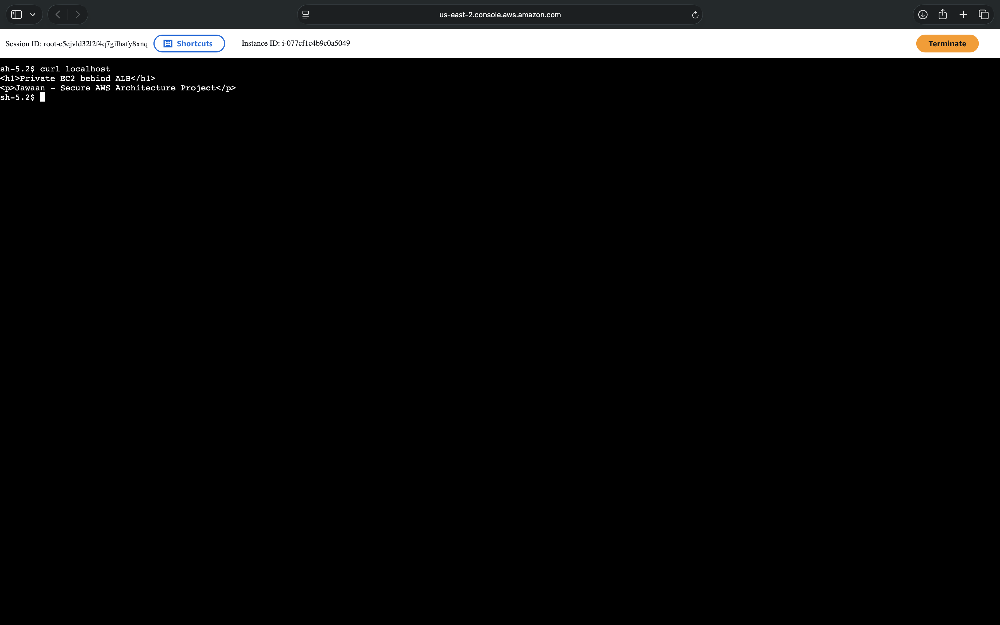

# Secure AWS Web Architecture

Private Amazon Elastic Compute Cloud (EC2) web server behind a public Application Load Balancer (ALB) with secure administration using AWS Systems Manager (SSM) Session Manager and Virtual Private Cloud (VPC) Interface Endpoints.

## What I Built

- Private EC2 instance with no public IP
- Public Application Load Balancer handling all web traffic
- No Secure Shell (SSH) access
- Administration via AWS Systems Manager Session Manager
- VPC Interface Endpoints for private SSM connectivity
- Custom Security Groups and Network Access Control Lists (NACLs)

## Architecture Overview

User → Application Load Balancer → Target Group → Private EC2  
Admin → Systems Manager Session Manager → VPC Endpoints → Private EC2

## Services Used

- Amazon Elastic Compute Cloud (EC2)
- Application Load Balancer (ALB)
- Virtual Private Cloud (VPC)
- VPC Interface Endpoints
- AWS Systems Manager (SSM)
- Security Groups
- Network Access Control Lists (NACLs)
- Identity and Access Management (IAM)

## Screenshots

### Load Balancer Working

### Target Group Healthy

### Private Network ACL

### VPC Endpoints

### Session Manager Access

